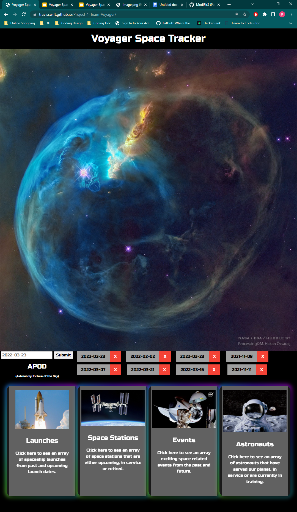

Link to live page:  https://travisswift.github.io/Project-1-Team-Voyager/

Voyager Space Tracker

# Project-1-Team-Voyager
An application that provides updates and information about launches and general information about space technology

When I view the calender
Then I see a list of upcoming space events

When I view the webpage
I see a picture of the day as the hero image

When I scroll down the webpage
THen I see a feed of current events

# Description

Team Voyager wanted to make a website where a user can come and find the latest in any astro news. In the homepage of the website the user will be able to view an APOD (astro picture of the day). This portion will display an image for the user and the user will also be able to interact with by choosing any date from present to past. Also within the homepage of this website there will be a navigation for the user to be able to choose what information they would like to view. Some of the features we offer as of present are launching information where the user can view different launches along with a countdown till launch. Other features are information on the ISS space station we also added a live view for the user, we also have a detailed list of information about astronauts along with a bio of them, and lastly a feature to view past and future astro events. 

# Contributor 

Cameron Stroup: https://github.com/cameronstroup

Travis Swift: https://github.com/TravisSwift

Steffen Gonzalez : https://github.com/Steffen568

Xan Hamilton: https://github.com/tsadiktalmudim

Paul Soliz: https://github.com/ModiFir3

# ScreenShots

